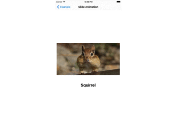
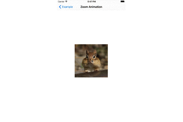

<!--  &nbsp;
 &nbsp;
[]() -->

YTATransitionAnimation
=======================

Simple slide & zoom transition




## Usage

**1.** Create YTATransitionAnimation instance and pass your UINavigationController to constructor.

```objective-c
self.transition = [[ZoomInteractiveTransition alloc] initWithNavigationController:self.navigationController];
```

**2.** Adopt YTATransitionAnimationProtocol by both source and destination view controllers and implement a single method

```objective-c
- (UIImageView *)imageViewForTransition
{
  return imageView;
}
```

## Requirements

* iOS 7
* ARC

## Customization

Available customizations:

* Duration
* Animation curve
* Interactive pop back gesture
